# Data Drive Project

## Overview

The Data Drive project is dedicated to enhancing user capabilities within the DFS ecosystem by providing a centralized dashboard. This dashboard facilitates users in storing, accessing, and sharing datasets seamlessly. With features such as file upload, download, and robust data management, users can control data sharing with varying permissions, ensuring privacy and security.

## System Requirements

### Tech Stack:

- **Frontend:** ReactJS
- **Backend:** NodeJS, ExpressJS
- **Database:** MySQL
- **Cloud Storage:** Minio
- **CSS Frameworks:** Bootstrap, MaterialUI, Vanilla CSS
- **Testing:** Postman, Mocha

### Dependencies:

The system relies on DFS authentication APIs and requires npm as a package manager for both client and server sides to install necessary dependencies.

**Server Setup**: 
- The .env files in ./server contains the variables needed for DB, server setup
- minioConfig.js contains configuration for the minio server\

**Client Setup**:
- The config.js file in ./client/src contains the API URLS and environment variables needed


### Run Commands
install dependencies(node_modules) in both client and server
- Run the script to compile the client build
```
./build.sh
```
- After building, run the server as a tmux/pm2k session 
```
cd server
nodemon server.js
```

## User Flow

Users have full control over the app's flow and navigation, with each component requiring user authorization. 
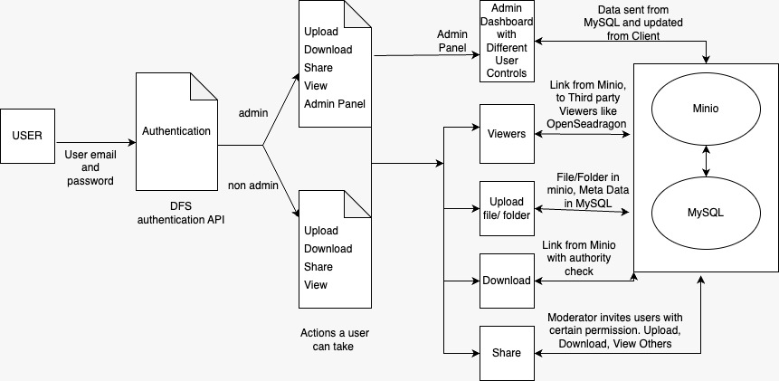

## Features - Funtional Requirements

### File Upload Functionality

Files and folders can be uploaded, stored in Minio under user buckets, and organized with metadata stored in MySQL.

  <p style="display: flex; justify-content: space-between;">
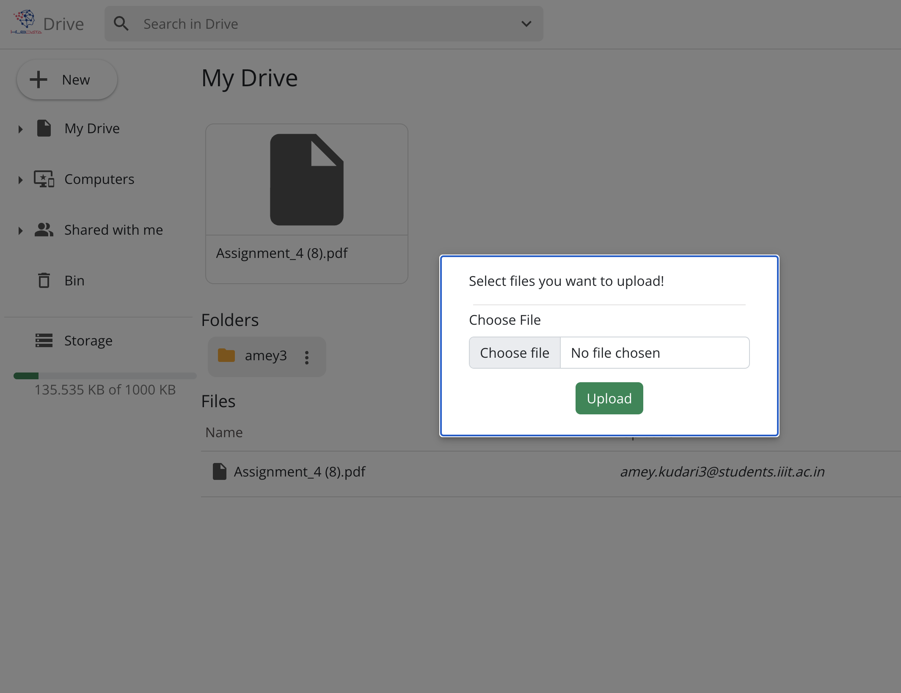
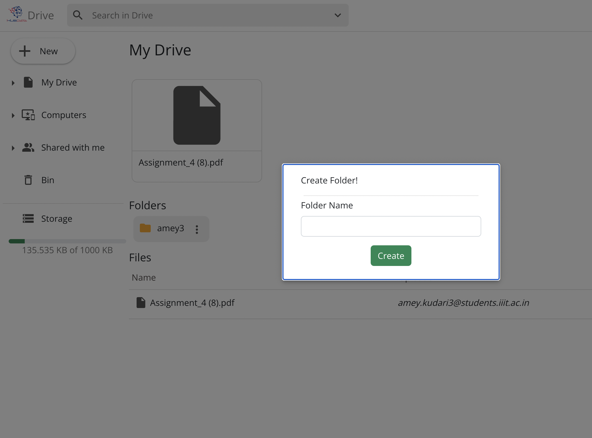
  </p>

### File Download Functionality

Users can directly download files from 'My Drive,' with Minio handling backend access and link generation. Shared files require download permissions.
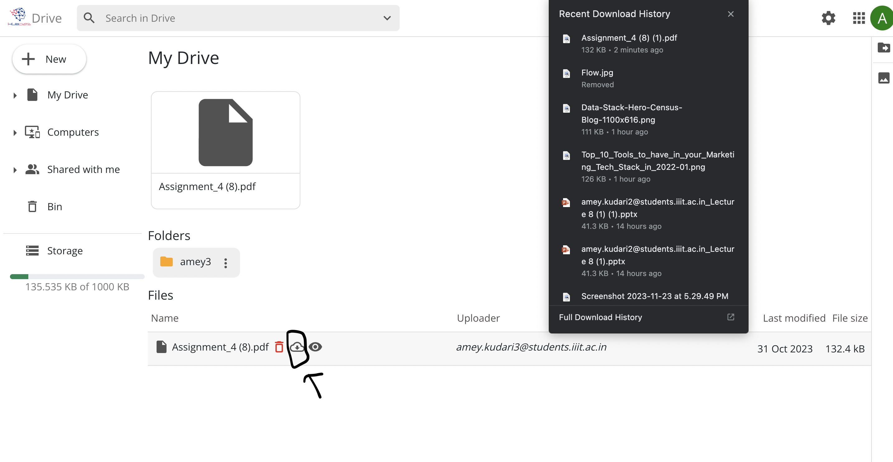

### Directory Navigation Functionality

Effortlessly navigate the directory structure for efficient organization and access of files.
  <p style="display: flex; justify-content: space-between;">
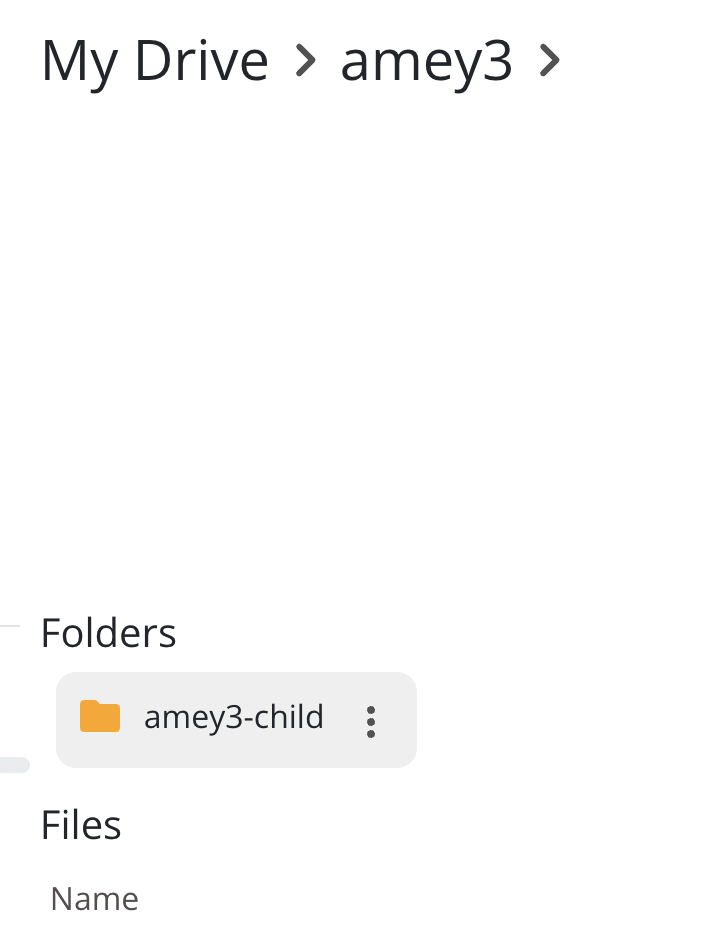
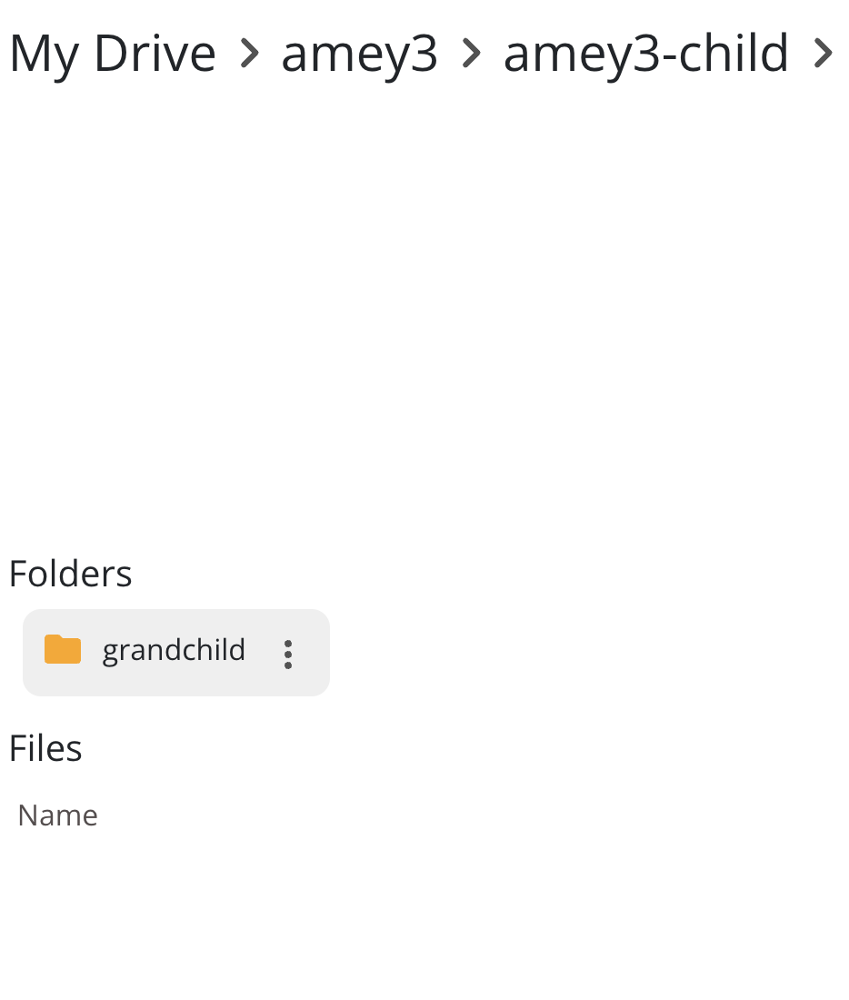
  </p>


### Sharing Functionality

1. **Sending Invitations:**
   Moderators add users to shared folders, sending invites that users can accept or reject. Accepted invitations grant access to the shared folder in 'My Shared' section.
   <p style="display: flex; justify-content: space-between;">
  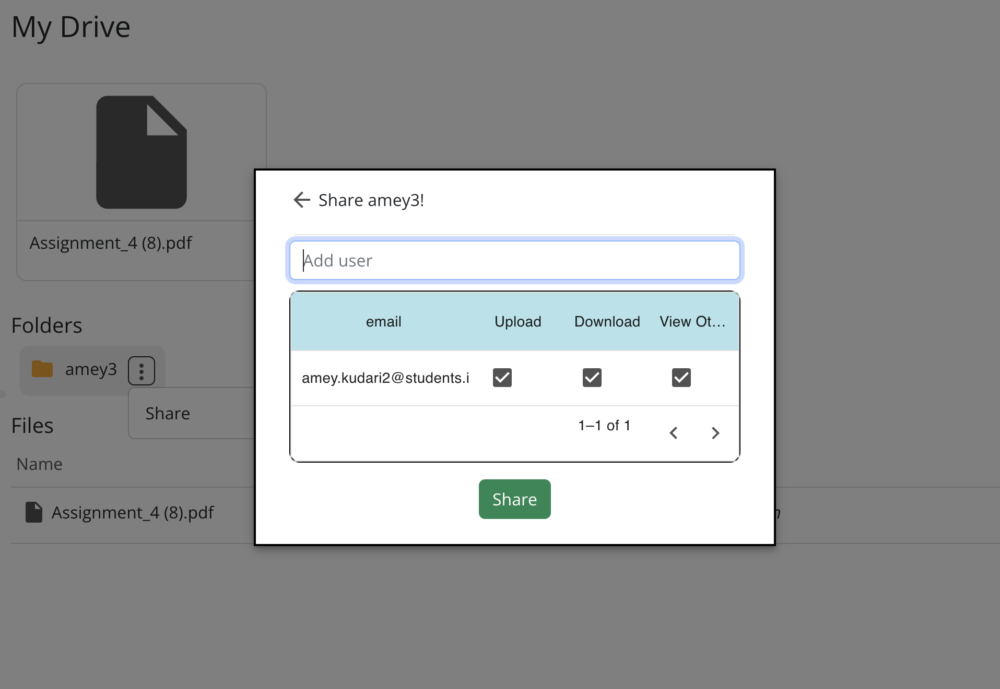
  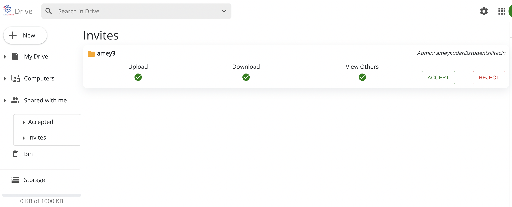
    </p>


2. **Shared Folders:**
   Moderators set permissions (Upload, Download, View Others) for each user, allowing secure file sharing within the shared folder.
   <p style="display: flex; justify-content: space-between;">
  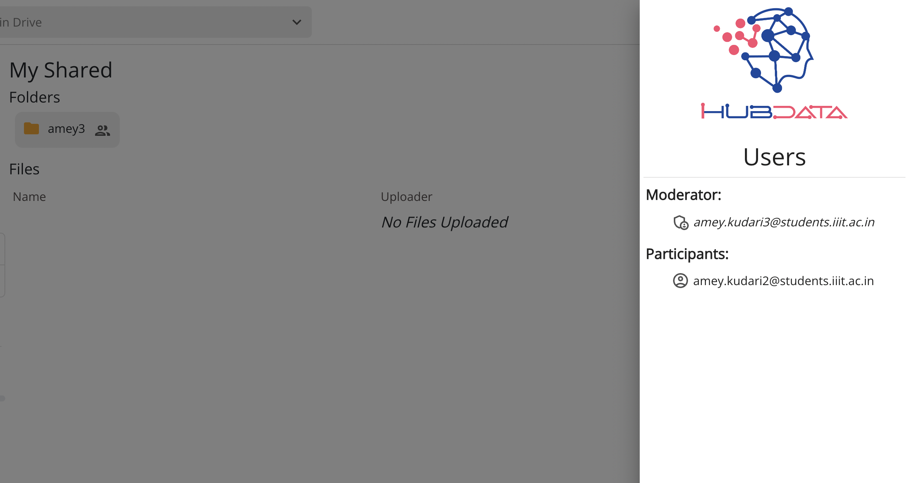
  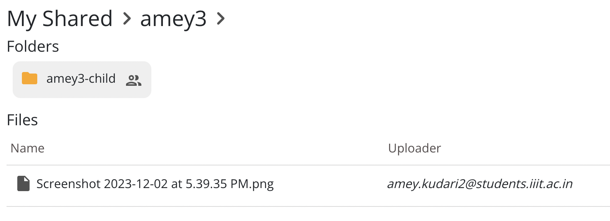
    </p>

### File Viewing Functionality

The app supports third-party apps for file viewing, enhancing extensibility within the DFS ecosystem.
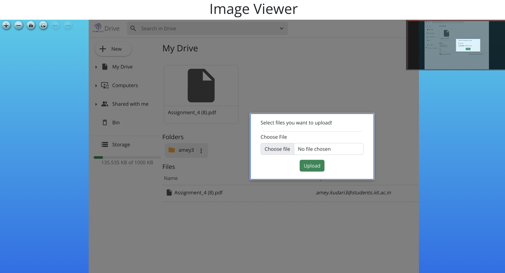

### Admin Dashboard

Accessible to users with 'admin' roles, the Admin Dashboard enables admins to view and manage users and resources. Admins can update max storage allotted to each user.
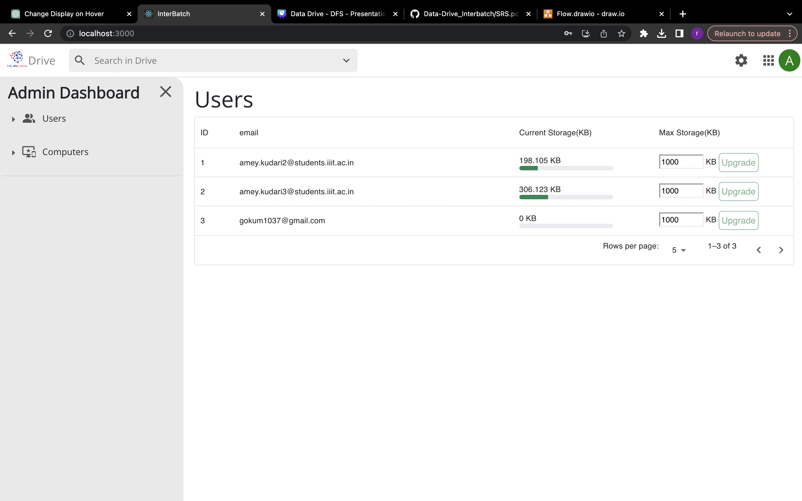

## Future Plans

The Data Drive project offers a foundation for future enhancements:

- **Multiple File Uploads:**
  Explore larger and multiple file uploads with designated Minio Cloud Storage access.

- **Invite through Links:**
  Extend sharing capabilities with link-based invitations, similar to Google Drive.

- **Integration of More Viewers:**
  Incorporate additional external apps for file viewing beyond the existing Histopathology Image viewer.

--- 
# Schema
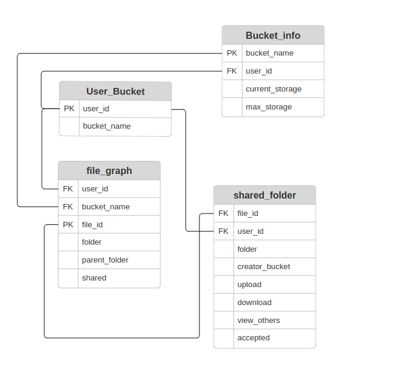

# This is the visualisation of tables with dummy values

### User_Bucket Table:
------------------------------
| user_id | bucket_name      |
|---------|------------------|
| user1   | Bucket1          |
| user2   | Bucket2          |
| user3   | Bucket3          |
------------------------------

### Bucket_info Table:
------------------------------------------------
| user_id | bucket_name      | current_storage | max_storage    |
|---------|------------------|------------------|----------------|
| user1   | Bucket1          | 500.0            | 1000000.0      |
| user2   | Bucket2          | 200.0            | 1000000.0      |
| user3   | Bucket3          | 700.0            | 1000000.0      |
-------------------------------------------------

### file_graph Table:
-------------------------------------------------
| user_id | bucket_name      | file_id | folder | parent_folder | shared |
|---------|------------------|---------|--------|---------------|--------|
| user1   | Bucket1          | file1   | docs   | null          | 0      |
| user2   | Bucket2          | file2   | images | photos        | 1      |
| user3   | Bucket3          | file3   | music  | null          | 0      |
-------------------------------------------------

### shared_folder Table:
---
| file_id | folder | creator_bucket | user_id | Upload | Download | view_others | accepted |
|---------|--------|-----------------|---------|--------|----------|-------------|----------|
| file1   | docs   | Bucket1         | user2   | 1      | 1        | 1           | 0        |
| file2   | images | Bucket2         | user3   | 1      | 1        | 1           | 1        |
| file3   | music  | Bucket3         | user1   | 0      | 1        | 1           | 0        |
---
