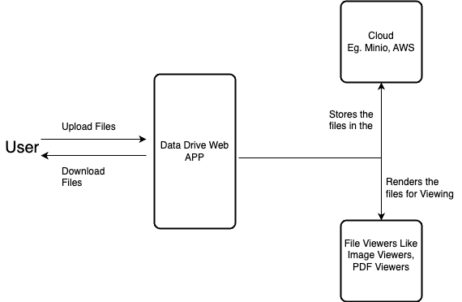
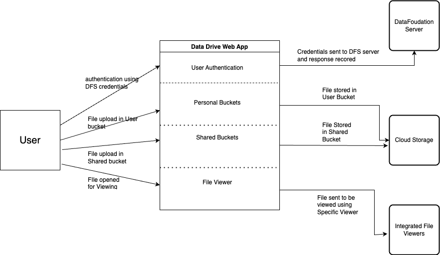

# Data Drive

Name: InterBatch
Team Members: Rhythm, Khushi, Aaryan
TA mentor: Smruti Biswal
Document Type: SRS/ Project Requirements

# Over View

The project is divided into 2 parts:

- Creating a ReactJS component that provides control for the Upload and download of dataset files between different Cloud buckets. This component can then be integrated with different DFS projects and provide uniformity of UI/UX
- Creating a Data Drive web app and the supported backend to enable users and researchers to upload their datasets to their Cloud buckets and share them to other users. The Data Drive will provide the major functionalities of the popular cloud drives like Google Drive, OneDrive etc.

Out team ****************INTERBATCH**************** will be working on the Latter part of the project. We will be working to create a Drive that that manage the seamless upload of local files into the Cloud and provide security and sharing capabilities on the uploaded Datasets. 

# System Requirements

### Tech Stack:

- Frontend - ReactJS
- UI - Vanilla CSS and frameworks like bootstap, TailwindCSS
- Backend - NodeJS and expressJS
- Database - MYSQL
- Cloud Database - MINIO

**Functional Requirements:**

1. **User Authentication and Registration:**
    - We'll implement user registration and authentication using the DFS login/registration API.
    - Users should have a secure login process
2. **User Secure Cloud Space:**
    - Each user will be assigned a personal Cloud space.
    - Users should be able to upload, download, and manage their files within their allocated space.
    - File organization should include folder creation, renaming, and deletion.
    - Users should have control over access permissions (private, shared, public) for their files.
3. **Shared Buckets:**
    - We'll provide the ability for users to create shared buckets for pooling resources.
    - Bucket owners should be able to invite and manage members with different permissions (READ, EDIT, DELETE, SHARE) for the bucket's content.
4. **File Sharing:**
    - Users should have the capability to share files within their personal space or shared buckets.
    - Sharing options will include generating shareable links.
    - Permissions for shared files should be configurable (READ, EDIT, DELETE).
5. **Files Viewer:**
    - Integrated viewers for various file types (e.g., Histopathology, PDF) will enhance user experience.
    - Users should be able to view file details and metadata.
    - Thumbnails and previews should be available for supported file formats.
    

**Non-Functional Requirements:**

**Usability Related Requirements:**

- Our web app must be designed with a responsive layout to ensure a smooth user experience across different devices such as desktop, mobile, and tablet.
- We'll prioritize usability by minimizing the number of steps required for common tasks.
- Ensuring cross-browser compatibility will make the app accessible to users on various web browsers.
- Multiple device support is crucial to maintain consistency and accessibility.

**Performance Related Requirements:**

- Quick response times are essential for user satisfaction; users should experience responsive interactions with the system.
- Efficient searching and retrieval of files, even when dealing with a large number of files, will enhance overall performance.
- Fast loading and rendering of files within the integrated viewers is crucial for a seamless user experience.

**Scalability Related Requirements:**

- Scalability is vital to accommodate a growing user base and increasing data storage requirements without compromising performance.
- The MYSQL database should be scalable to handle expanding data storage needs.

**Security Related Requirements:**

- We must ensure robust user authentication to safeguard user data.
- Implement data encryption for data at rest and in transit to enhance security.
- Strict access controls will prevent unauthorized access to files and resources.
- Secure API communication between ReactJS (frontend) and NodeJS (backend) is a must.

By following these requirements, we aim to build a web application that not only fulfills functional needs but also provides an excellent user experience while ensuring security and scalability.

# Project Deliverables

| Requirement | Description |
| --- | --- |
| Creating a web App with user friendly simple UI  | We plan to use ReactJS as our frontend framework with NodeJS at the backend and MYSQL for Database storage. For Cloud environment we will be working with the MINIO Object storage Cloud database. |
| User authentication and user secure space in the Cloud  | The Users will be authenticated using DFS login/registration API so that the users can seamlessly manoeuvre within the DFS ecosystem. Every user will be provided personal Cloud space to maintain security and provide user level abstraction |
| Creating shared buckets and adding bucket members  | Enable sharing in the drive by adding the feature of creating shared buckets and adding members to the bucket that would act like a pool of shared resources when a user wants to share a file within the group. Different permissions over the files can be set like READ, EDIT, DELETE, SHARE  |
| Files Viewer | File viewers will be integrated with the web app to enable viewing of different kinds of files like Histopathology viewer, PDF files along with file details and metadata |